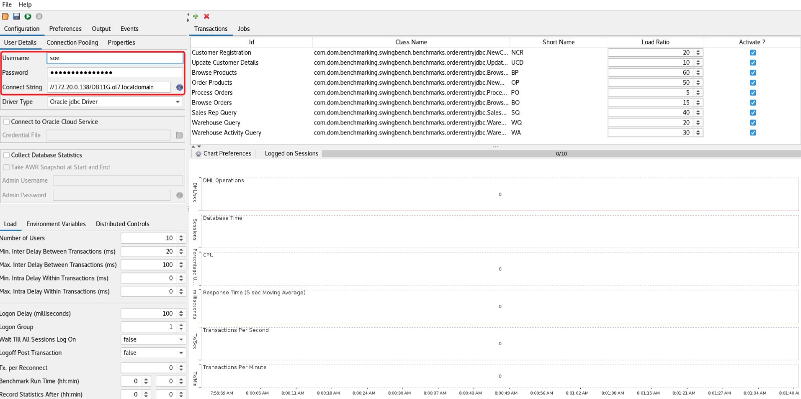
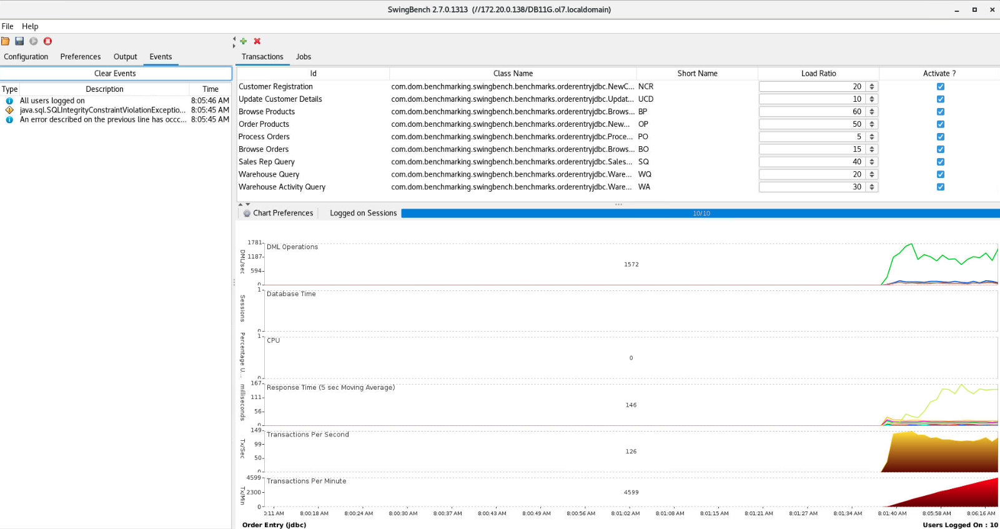

Kudos to `Dominic Giles` for building such a fantastic product.

> As the latest version of swingbench is not compatible with Oracle 11g, but most of the users onprem still are using Oracle 11g and seek a way to move to cloud to achieve better TCO. However, they still need to validate the performance between 11g and Cloud Database such as Oracle Autonomous Database. So that is why I keep this version to my repo or for others to replicate.

All code is provided as seen. Further information is provided at

http://www.dominicgiles.com/swingbench.html


## Swingbench Install
---
Clone the repo to get the source artifact of `swingbench`

```
git clone https://github.com/nikosheng/swingbench-oracle11g.git
```

Change into the newly created swingbench directory and then either the "bin" directory
for Linux/Unix or the "winbin" for windows systems.

By default java isn’t installed on this VM so we’ll need to install it via yum. We’ll need to update yum first

```
sudo yum makecache fast
sudo yum install java-1.8.0-openjdk-headless.x86_64
java -version
```

For Windows user, please go to https://www.oracle.com/java/technologies/javase/javase8-archive-downloads.html to download the JDK8 installer

**Please ensure to use Java 8 to proceed the swingbench benchmarking**

You should then be able to run swingbench or any of the wizards.

## Swingbench Initialization
Please be aware that there will be some privileges problems during the data load generator, and if so, please add below sql for granting privileges to public.

```
GRANT EXECUTE ON dbms_stats TO public;
GRANT EXECUTE ON dbms_lock TO public;
GRANT SELECT ON sys.v_$parameter TO public;
```

Once ready, we can start to generate the SOE test schema for benchmarking. We can adjust the parameters to cater for the benchmarking. For example, we can adjust `scale` to a small or large number to control the size of the dataset.

**Linux**
```
bin/oewizard -cs //172.20.0.138/DB11G.ol7.localdomain -ts SOE -dba system -dbap PASSWORD## -u soe -p PASSWORD## -scale 10 -create -cl -tc 4 -v
```

**Windows**
Please enter into the `winbin` folder to execute below command
```
java -cp ../launcher LauncherBootstrap -executablename oewizard oewizard -c oewizard.xml
```


## Swingbench GUI
Next we can launch the swingbench GUI to start benchmarking.

**Linux**
```
bin/swingbench -c oeconfig.xml
```
Once the GUI is launched, we need to switch the config file to start the SOE benchmarking.

**Windows**
```
java -cp ../launcher LauncherBootstrap -executablename swingbench swingbench -c swingconfig.xml
```

## Start Benchmarking
We need to fill in the connection details to connect to the target database in the GUI configuration



Once ready, click the `Run` button on the top left corner to launch the testing.



## Cleanup

If needed, we can clean the test schema to erase all the benchmarking objects

```
bin/oewizard -cs //172.20.0.138/DB11G.ol7.localdomain -ts SOE -dba system -dbap PASSWORD## -u soe -p PASSWORD## -scale 10 -drop -cl -tc 4 -v
```
